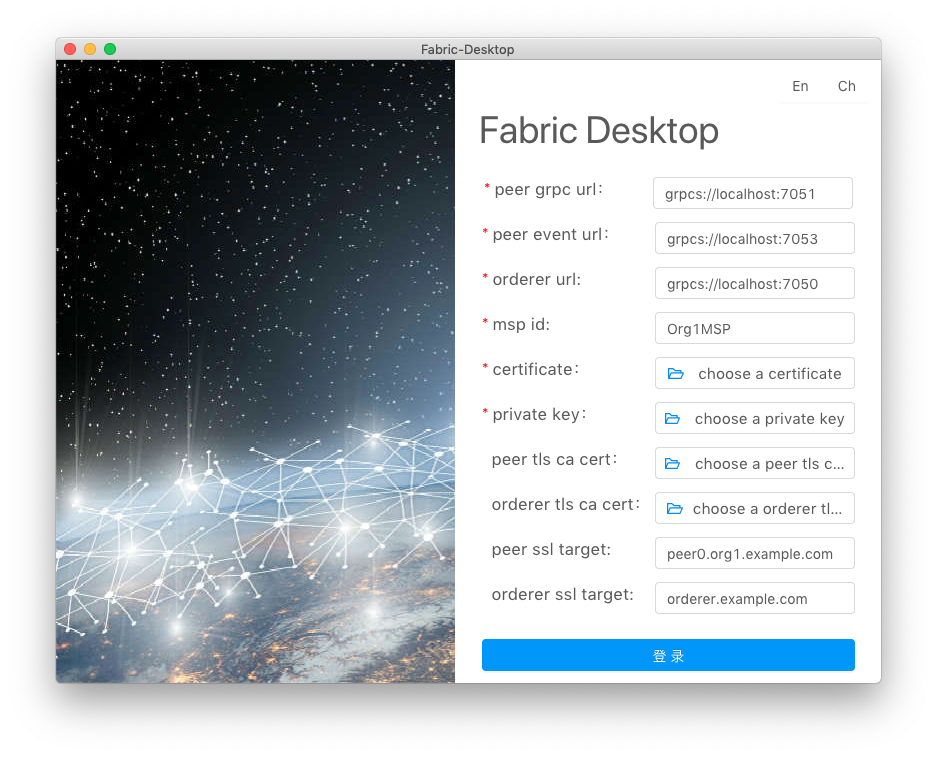
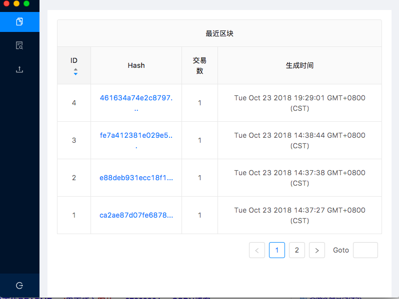
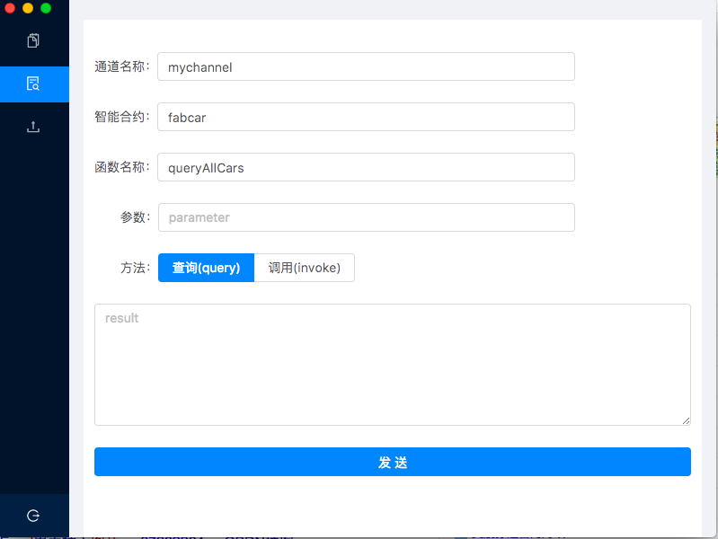
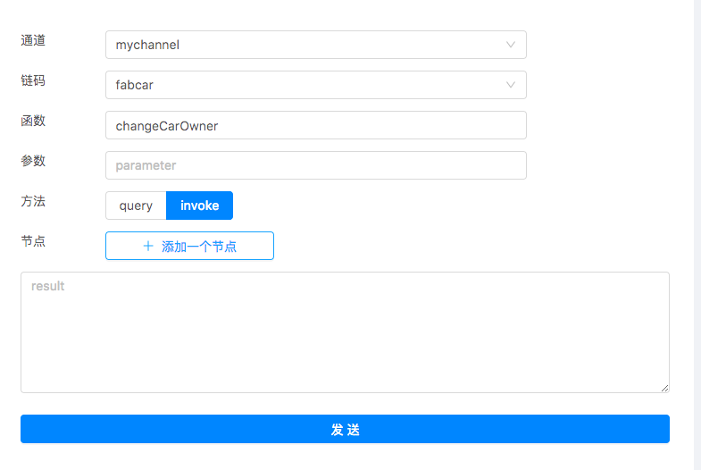
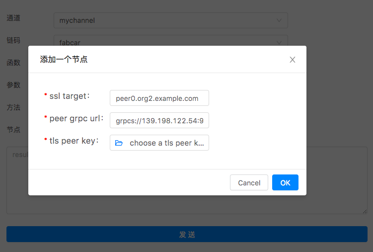
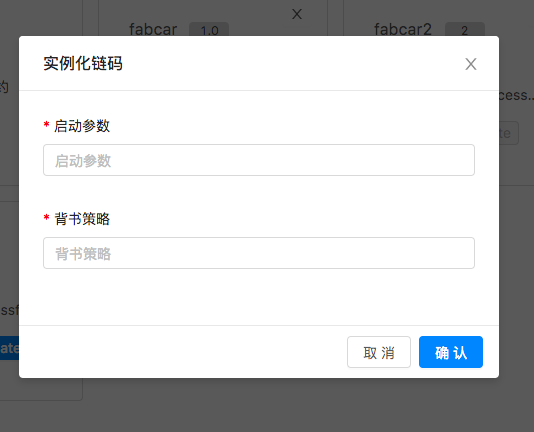
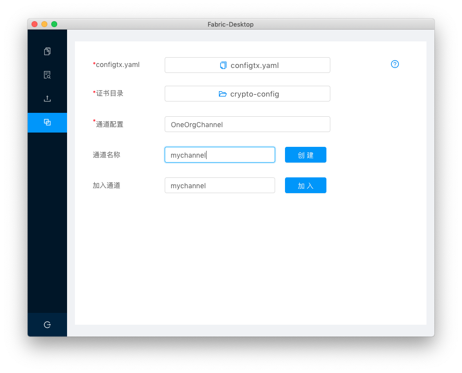
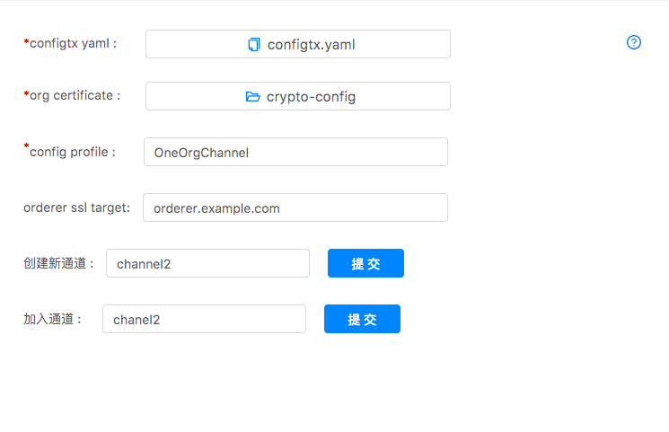

# 用户文档

## 预览

1. 开始使用客户端
2. 联系我们

### 1.开始使用客户端

#### 1.1 安装客户端

如果您不清楚如何安装源代码和客户端，您可参考[setup](setup-Ch.md)文档。

#### 1.2 开始使用

双击打开客户端，现在开始使用客户端，现在客户端包含五个部分：

1. 用户登录
2. 数据看板
3. 链码调用
4. 链码安装
5. 通道管理

##### 1.2.1 用户登录
输入`peer grpc url`,`peer event url`,`orderer url`,`msp id`，选择`certificate`文件和`private key`文件后，点击登录。

> 注意： 
> 在hyperledger fabric体系的角色里，存在peer\orderer\user三种角色，客户端面向user角色，在user角色下，存在admin和
> 普通user两种，admin可安装和实例化(invoke和instantiate)链码，而普通user只可调用和查询(invoke和query)链码。

操作演示：

如我们要连接到本地fabric网络，以`admin`角色登录:
- peer grpc url 填 grpc://localhost:7051, 
- peer event url 填 grpc://localhost:7053，
- orderer url 填 grpc://localhost:7050, 
- msp id 填 Org1Admin，
- 选择certificate文件为crypto-config/peerOrganizations/org1.example.com/users/Admin@org1.example.com/signcerts下的Admin@org1.example.com-cert.pem,
- 选择private key文件为crypto-config/peerOrganizations/org1.example.com/users/Admin@org1.example.com/keystore下的cd96d5260ad4757551ed4a5a991e62130f8008a0bf996e4e4b84cd097a747fec_sk文件

点击登录。

##### 1.2.2 数据看板
在数据看板中，我们可以查询与通道相关的区块信息。如选择`mychanel`,则可看到相关区块信息。   

点击表格中Hash列任一行的记录，可查看`区块`信息，并可查看`交易`及交易是否有效，如下：

点击`交易列表`的记录，，如下:

##### 1.2.3 链码调用
在链码调用界面中，选择`通道`、`链码`后，输入`函数名称`、`参数`(其中参数可输入多个),选择`query`时，点击`发送`按钮，则可以查询相关信息。

如选择`invoke`，点击`发送`按钮,则可进行相关账本更新。

如在`invoke`操作时需要多节点背书，添加相关节点进行背书。

具体操作可参考[Quqering the Ledgr](https://hyperledger-fabric.readthedocs.io/en/release-1.3/write_first_app.html#querying-the-ledger)。

> 注: 
> 查询操作（query）只是查询数据，不会生成新的区块，调用操作（invoke）会发起新的交易，产生新的区块
此时，我们可以回到数据看板页面，可以看到已经产生了新的记录。

操作演示:

查询操作(query)：
- 输入通道为`mychannel`，
- 输入链码为`fabcar`，
- 输入函数为`queryAllCars`
- 参数为空，不需要任何输入
- 方法选择`query`

点击发送按钮，可以查看相关返回信息。

调用操作(invoke)：
- 输入通道为`mychannel`，
- 输入链码为`fabcar`，
- 输入函数为`changeCarOwner`
- 输入第一个参数`CAR10`，回车后输入第二个参数`Chuancey`，

点击发送按钮，我们可以查看相关返回信息提示成功后，回到数据看板页面，可查看新产生的区块。

这里链码不需要多节点背书，如果链码需要多节点背书，可添加相关节点进行背书。

##### 1.2.4 链码安装

在使用链码安装时，如果您将要操作的链码文件是Go语言类型，你需要为客户端设置环境变量`GOPATH`，如在linux平台下，你可以在`〜/.bashrc`文件中进行配置。

> 注意！ 
> 在MAC平台下，当你直接从程序的快捷方式打开客户端程序时，需再设置一套GUI环境变量,具体设置方法见[Desktop-FAQ](Desktop-FAQ-Ch.md)。

在链码安装页面里，我们可以查看已经添加的各个智能合约.

点击`添加合约`按钮，将会弹出`添加合约`弹窗,可添加新的智能合约。

操作演示:
- 输入链码名称为`fabcar4`
- 输入链码版本为`4`
- 选择通道为`mychannel`
- 选择路径为`github.com/hyperledger/fabric-dev-network/chaincode/fabcar/go`

点击确认。

> 注意： 
> fabric默认在GOPATH路径下src文件夹下寻找链码文件，路径只需具体到链码文件的上一层目录，您可参考下面的例子：
如：要安装的链码文件的完整路径为：`/Users/chuancey/go/src/github.com/hyperledger/fabric-dev-network/chaincode/fabcar/go/fabcar.go`
GOPATH为`/Users/chuancey/go`，需填入的路径为：`github.com/hyperledger/fabric-dev-network/chaincode/fabcar/go`

如果觉得这样填入链码文件路径比较麻烦，我们已经提出了[issue](https://github.com/blockchain-desktop/hyperledger-fabric-desktop/issues/16)
,并正在解决。

智能合约子窗口添加后，我们可以进行安装链码`install`和实例化链码`instantiate`。在链码的实例化操作时，如果需要
设置链码的启动参数`contruct`和背书策略`endorsement policy`,你可点击`instatiate with opts`

点击确认后，即可实例化链码，如不需要，直接点击`instantiate`，实例化链码。

此外，我们还可以查看不同通道下已经实例化的链码有哪些，如查看`channel1`通道下：

##### 1.2.5 通道管理

创建新通道: 选择`configtx.yaml`, 组织证书`org certificate`, 输入通道配置文件`config profile`，`orderer ssl target`, 以及
通道名称`channel name`后，点击`提交`按钮，可创建新的通道。

输入通道名称后，并且可以加入通道。

操作演示:

假设我们的`configtx.yaml`配置如下：

- 选择`configtx.yaml`(选择此configtx.yaml文件)
- 选择`org certificate`(注意标红部分，选择在configtx.yaml配置的证书目录，如果是多级目录，选择顶级目录即可)
- 输入`config profile`(即`configtxgen -profile OneOrgChannel -outputCreateChannelTx ./config/channel.tx`命令的`- profile`选项的内容)
- 输入 `orderer ssl target`（注意标红部分，选择在configtx.yaml配置的orderer节点域名）
- 输入`channel name`（输入要创建的通道名称）

输入新生成的通道名称后，我们可以加入此通道。

### 2. 联系我们

如果您在使用上有任何问题，欢迎提出[issue](https://github.com/blockchain-desktop/hyperledger-fabric-desktop/issues)，
我们会及时处理，并对您的反馈报以真挚的感谢！
