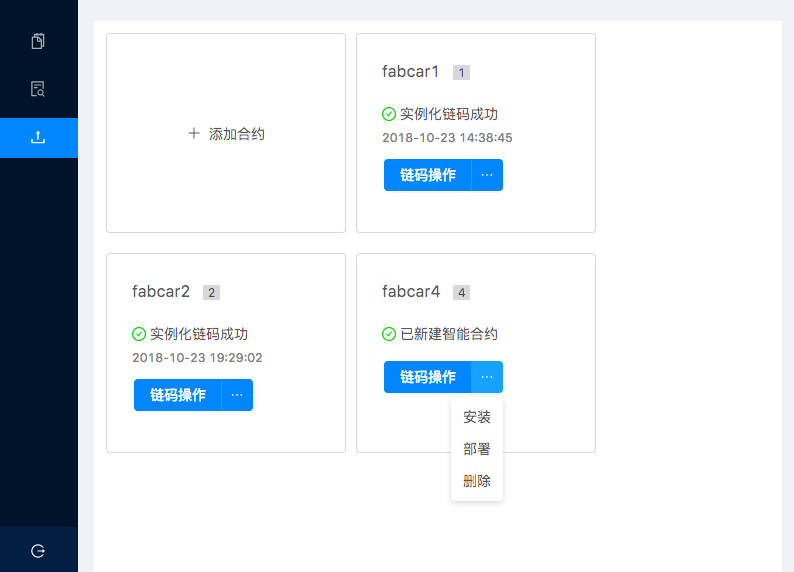

# 用户文档

## 预览

1. 开始使用客户端
2. 联系我们

### 1.开始使用客户端

#### 1.1 安装客户端

如果您不清楚如何安装源代码和客户端，您可参考[setup](setup-Ch.md)文档。

#### 1.2 开始使用

双击打开客户端，现在开始使用客户端，客户端包含四个部分：

1. 用户登录
2. 数据看板
3. 链码调用
4. 链码安装

##### 1.2.1 用户登录
输入peer grpc url,peer event url,orderer url,username，选择certificate文件和private key文件后，点击登录。

注意：在hyperledger fabric体系的角色里，存在peer\orderer\user三种角色，客户端面向user角色，在user角色下，存在admin和
普通user两种，admin可安装和调用链码，而普通user只可调用链码。

如：我们在本地运行fabric网络后，peer grpc url 填 grpc://localhost:7051, peer event url 填 grpc://localhost:7053，
orderer url 填 grpc://localhost:7050, username 填 Org1Admin，选择certificate文件为signcerts文件夹下的
Admin@org1.example.com-cert.pem, 选择private key文件为keystore文件夹下的cd96d5260ad4757551ed4a5a991e62130f8008a0bf996e4e4b84cd097a747fec_sk文件
点击登录。

##### 1.2.2 数据看板
在数据看板中，我们可以查询区块相关信息。

点击表格中Hash列任一行的记录，可查看相关信息，如下：

##### 1.2.3 链码调用
在链码调用界面中，输入通道名称、智能合约、函数名称、参数、其中参数可输入多个,并选择是查询或者调用操作后，点击发送按钮，可获得相关
返回信息。

具体操作可参考[Quqering the Ledgr](https://hyperledger-fabric.readthedocs.io/en/release-1.3/write_first_app.html#querying-the-ledger)

其中，查询操作（query）只是查询数据，不会生成新的区块，调用操作（invoke）会发起新的交易，
如果发起新的交易，我们回到数据看板页面，可以看到已经产生了新的区块。

如：输入通道名称为`mychannel`，智能合约为`fabcar`。

查询操作(query)：输入函数名称为`queryAllcars`，不需要任何参数，点击发送按钮，可以查看相关返回信息。

调用操作(invoke)：输入函数名称为`changeCarOwner`，输入第一个参数`CAR10`，回车后输入第二个参数
`Chuancey`，点击发送按钮，我们可以查看相关返回信息，回到数据看板页面，查看新产生的区块。

##### 1.2.4 链码安装

在使用链码安装时，如果您将要操作的链码文件是Go语言类型，你需要为客户端设置环境变量`GOPATH`，如在linux平台下，你可以在`〜/.bashrc`文件中进行配置。

> 注意！ 
> 在MAC平台下，为GUI程序设置环境变量的具体设置方法见[Desktop-FAQ](Desktop-FAQ-Ch.md)。

在链码安装页面里，我们可以查看已经添加的各个智能合约.

点击添加合约按钮，将会弹出添加合约弹窗。

输入链码名称、版本号、通道名称、链码文件路径和功能描述，其中，链码名称、版本号、通道名称、链码文件路径为必填项，功能描述非必填项。
点击添加，即可添加新的智能合约。

注意：
1. 目前，我们只实现了单通道，所以通道名称需填"mychannel"
2. fabric默认在GOPATH路径下src文件夹下寻找链码文件，路径只需具体到链码文件的上一层目录，您可参考下面的例子：
如：要安装的链码文件的完整路径为：`/Users/chuancey/go/src/github.com/hyperledger/fabric-dev-network/chaincode/fabcar/go/fabcar.go`
GOPATH为`/Users/chuancey/go`，需填入的路径为：`github.com/hyperledger/fabric-dev-network/chaincode/fabcar/go`

如果觉得这样填入链码文件路径比较麻烦，我们已经提出了[issue](https://github.com/blockchain-desktop/hyperledger-fabric-desktop/issues/16)
,并正在解决。

此外，您可在新的智能合约窗口中进行相关智能合约操作，如安装、部署、删除操作。其中，安装操作对应链码的
`install`操作,部署操对应链码的`instantiate`操作。

### 2. 联系我们

如果您在使用上有任何问题，欢迎提出[issue](https://github.com/blockchain-desktop/hyperledger-fabric-desktop/issues)，
我们会及时处理，并对您的反馈报以真挚的感谢！
