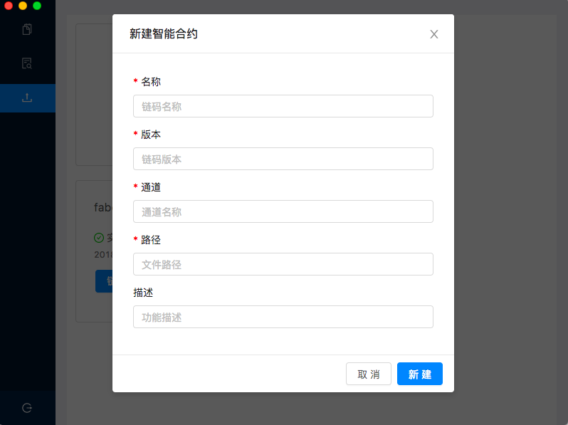

# Tutorial

## Preview
1. Start your first tutorial
2. Contact us

### Start your first tutorial

#### Install the desktop

If you are not familiar with installing the desktop,you can refer to [setup documentation](./setup-En.md).

#### Start your tutorial

Double click and run Hyperledger Fabric Desktop, the desktop contains four parts:
1. Login
2. Block Dashboard
3. Chaincode Invoke
4. Chaincode Install  

##### Login


Suppose you input those fields:

- peer grpc url : `grpc://localhost:7051` (replace this with your peer grpc url)
- peer event url : `grpc://localhost:7053` (replace this with your peer event url)
- orderer url : `grpc://localhost:7050`    (replace this with your orderer url)
- username : ` Org1Admin` (choose a random username)
- certificate: choosing a certificate of user
- private key: choosing a private key of user

After successful adding, click the `login` button.

> Note!  <br />
> In hyperledger fabric,there are three or more roles,eg.,peer,orderer,user. The desktop is oriented to the role 'user',
> and there are admin user and normal user.Admin user can install and invoke the chaincode while normal user can only
> invoke the chaincode.

##### Block Dashboard

We can query information on blocks through block dashboard.


Click on the record for any row in the 'Hash' column of the table,you can view related information.


##### Chaincode Invoke


Suppose you input those fields:

- Channel Name : `mychannel` (replace this with your channel name)
- Chaincode Name :`fabcar` (replace this with your chaincode name)
- Function Name : `queryAllCars` (replace this with your function name)
- Parameter : null  (If the function doesn't need parameters )
- Methods : query （query or invoke）

Click on the `send` button,then you can see the result.

>  Note!  <br />
>  The operation `query` only queries data,no block will be generated.
>  The operation `invoke` will launch a new bill,and generate a new block
>  If there is a new bill launched, we can see a new generated block on
>  Block Dashboard,According to the setting of the fabric network.

##### Chaincode Install

Before we start, if chaincode's type is Golang,there is a environment variable you need to set for a GUI program properly; 
you can make this setting permanent by placing them in the appropriate startup file, the same method as setting environment
variable for terminal program, such as your personal` ~/.bashrc` file if you are using the bash shell under Linux, 
with something like:
```bash
export GOPATH=$HOME/go
```

> Note!<br />
> But for macOs, GUI program and terminal program using two different sets of environment variables，
> As for setting environment variables for GUI program, you can refer to [Desktop-FAQ](../doc-Zn/Desktop-FAQ-Zn.md).


We can view all the smart contracts that have been added.


Click the `add` button, a window will be popped up. 



Suppose you input those fields:

- Chaincode Name* :`fabcar1` (replace this with your chaincode name)
- Version* :`1` （type a version）
- Channel Name* :`mychannel` (replace this with your channel name)
- Chaincode Path* :`github.com/hyperledger/fabric-dev-network/chaincode/fabcar/go`
- Description :`car` (mark the effect of chaincode)

>  Note!  <br />
>  If chaincode's type is Golang, then the path is the fully qualified
>  package name under the `src` folder of `GOPATH`.

After the chaincode added,you can perform operations like `install`,`instantiate`,`delete`.

### Contact us

If there are any problems when using the desktop, please raise a new [issue](https://github.com/blockchain-desktop/hyperledger-fabric-desktop/issues)
on github, we will handle it in time, and thank you sincerely for your feedback.
