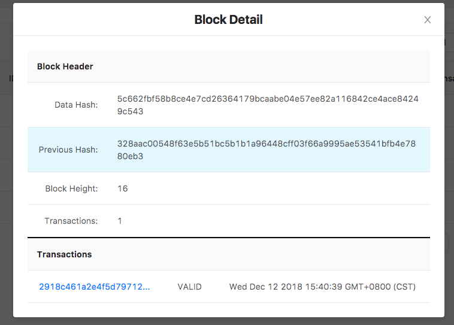
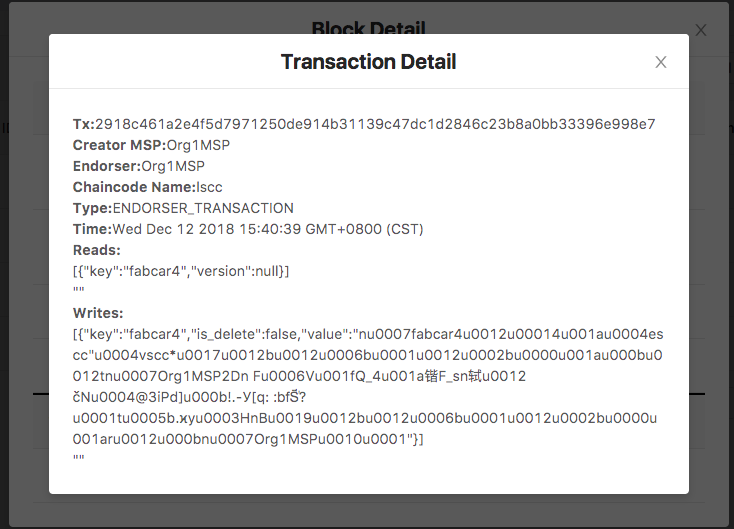
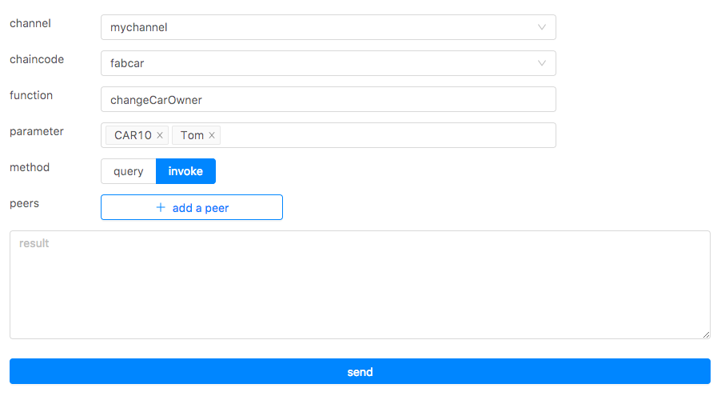
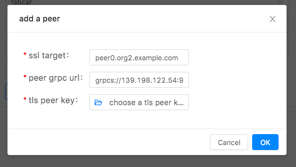
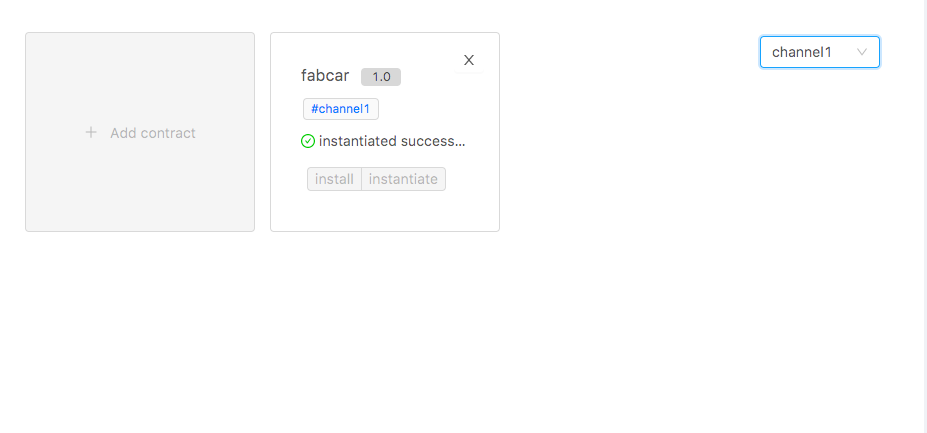
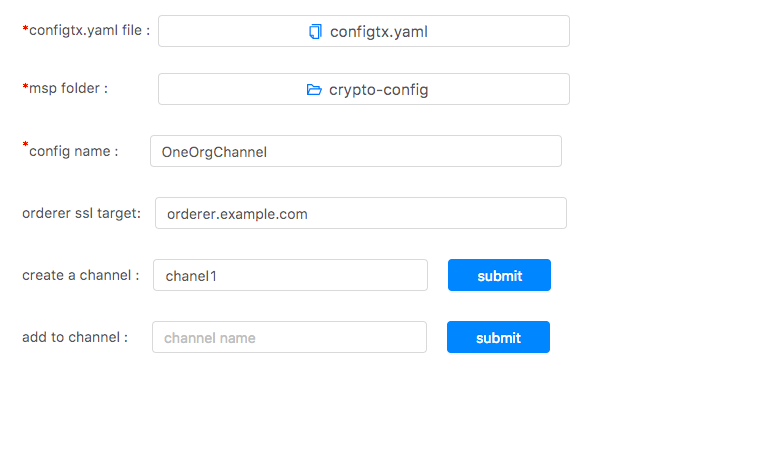

# Tutorial

## Preview
1. Start your first tutorial
2. Contact us

### Start your first tutorial

#### Install the desktop

Following the [setup documentation](./setup-En.md) to install Hyperledger Fabric Desktop.

#### Start your tutorial

Double click and run the desktop, now it contains five parts:
1. Login
2. Block Dashboard
3. Chaincode Invoke
4. Chaincode Install  
5. Channel Manage

##### Login


Suppose we connect to the local fabric network and log in as the `admin` role, you shall input those fields:

- peer grpc url : `grpc://localhost:7051` (replace this with your peer grpc url)
- peer event url : `grpc://localhost:7053` (replace this with your peer event url)
- orderer url : `grpc://localhost:7050`    (replace this with your orderer url)
- msp id : ` Org1Admin` (type a msp id)
- certificate: choosing certificate of a `admin` user (the file under `keystore` folder)
- private key: choosing private key of a `admin` user (the file under `signcerts` folder)


After successful adding, click the `Sign in` button.

> Note!  <br />
> In hyperledger fabric,there are three or more roles,eg.,peer,orderer,user. The desktop is oriented to the role 'user',
> and there are two kinds: 'admin user' and 'normal user'. 'Admin user' can install and instantiate the chaincode while
> 'normal user' can only invoke and query the chaincode.

##### Block Dashboard

We can view blocks related to the channel on block dashboard. Suppose you select `mychanel`, 
you can see the relevant block information.


Click on any row in the 'Hash' column of the table, you can view information about block and transactions, as well as  
whether transactions are valid or not.



Click on the record of `Transactions`, you can view the detail about transaction.



##### Chaincode Invoke

Before we start, you should make sure you've installed and instantiated a chaincode, here we've
installed and instantiated a chaincode called `fabcar`.

If you'd like to query the ledger, you can input those fields:

- Channel Name : `mychannel` (replace this with your channel name)
- Chaincode Name :`fabcar` (replace this with your chaincode name)
- Function Name : `queryAllCars` (replace this with your function name)
- Parameter : null  (the function doesn't need any parameter)
- Methods : query （query or invoke）

Click on `send` button,then you will see the result.


If you'd like to update the ledger, you can input those fields:

- Channel Name : `mychannel` (replace this with your channel name)
- Chaincode Name :`fabcar` (replace this with your chaincode name)
- Function Name : `changeCarOwner` (replace this with your function name)
- Parameter : `CAR10` `Tom`
- Methods : invoke （query or invoke）



Here the chaincode 'fabcar' doesn't require multi-node endorsement,we can ignore the operation `add a peer`.
Click on `send` button,then you will see the result.

If multi-node endorsement is required when `invoke` , related nodes should be added for endorsement.



>  Note!  <br />
>  The operation `query` only queries data,no block will be generated.
>  The operation `invoke` can initiate a new bill,and generate a new block.
>  And we can see the new generated block on 'Block Dashboard'.

For specific operations, you can refer to [Quqering the Ledgr](https://hyperledger-fabric.readthedocs.io/en/release-1.3/write_first_app.html#querying-the-ledger)。

##### Chaincode Install

Before we start, if chaincode's type is Golang,there is a environment variable you need to set for the GUI program properly; 
you can make this setting permanent by placing them in the appropriate startup file such as your personal` ~/.bashrc` file, 
as same as setting environment variables for terminal program, if you are using the bash shell under Linux, with something like:
```bash
export GOPATH=$HOME/go
```

> Note!<br />
> If you are using macOs, GUI program and terminal program use two different sets of environment variables.
> As for setting environment variables for GUI program on macOs, you can refer to [Desktop-FAQ](../doc-En/Desktop-FAQ-En.md).

We can view all the smart contracts that have been added on the page.


Click the `Add contract` button, a window will be popped up. 


Suppose you input those fields:

- Chaincode Name :`fabcar5` (replace this with your chaincode name)
- Version:`5` （type a version）
- Channel Name :`mychannel` (so far,you can't change the value)
- Chaincode Path :`github.com/hyperledger/fabric-dev-network/chaincode/fabcar/go`

After the chaincode added, you can install and instantiate the chaincode .

>  Note!  <br />
>  If chaincode's type is Golang, then the path is the fully qualified
>  package name under the `src` folder of `GOPATH`.For example, You can create a new folder `cc`
>  under the `src` folder of `GOPATH` and put your chaincode file there.
>  Then just need to type `cc` in the `Chaincode Path` field.

If you feel it is cumbersome to fill in the path of the chaincode file, we have already proposed [issue](https://github.com/blockchain-desktop/hyperledger-fabric-desktop/issues/16)
and is being solved.

After installed the chaincode and to instantiate, if needed, click on `instatiate with opts`, 
you can set `contruct` parameter and `endorsement policy` for the chaincode, 


In addition, we can see instantiated chaincodes under different channels.For example, we can see instantiated chaincodes under channel `channel1`.




##### Channel Manage

You need be clear that the creation of the channel depends on the `configtx.yaml` file. Create a new channel for only one organization, 
suppose your `configtx.yaml` is :


Now create a new channel:

- Configtx.yaml file: choose the `configtx` file
- msp folder: pay attention to the red mark, select the certificate directory configured in configtx.yaml(if it is a multi-level directory, select the top-level directory.)
- config name: `OneOrgChannel`(the content of the `-profile` option of `configtxgen -profile OneOrgChannel -outputCreateChannelTx ./config/channel.tx` command)
- orderer ssl target:`orderer.example.com`(note the red mark, select the domain name of the orderer node configured in `configtx.yaml`)
- channel name:`channel`



Click on 'create channel' button, the channel will be created. 

After the channel created, input the channel name that we are going to join, click `join channel` button, and the peer node that 
we are connecting will join the channel.

### Contact us

If there are any problems when using the desktop, please raise a new [issue](https://github.com/blockchain-desktop/hyperledger-fabric-desktop/issues)
on github, we will handle it in time, and thank you sincerely for your feedback.
