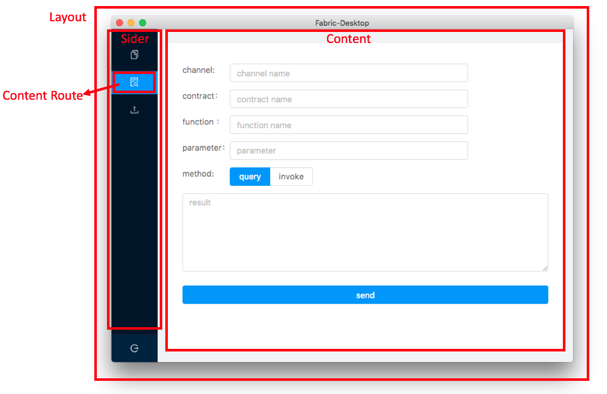
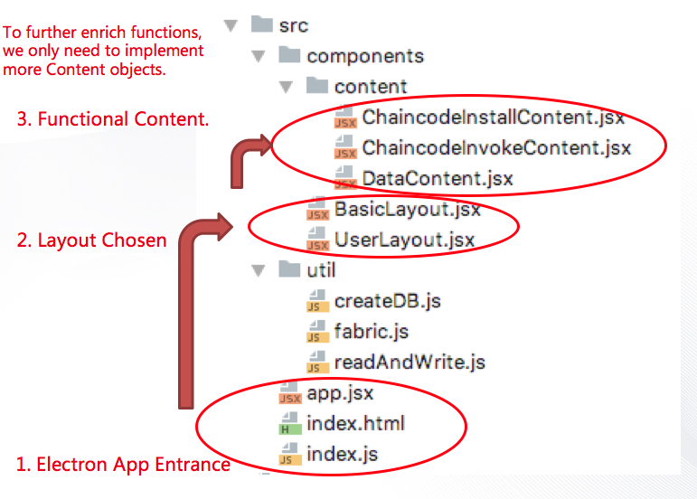

# Hyperledger Fabric Desktop
2018-10-31

## HIP identifier
Fabric Desktop

## Sponsors
* DENG, Yi (michael.yi.deng@gmail.com)
* HUANG, Jishun (874904407@qq.com)
* YANG, Changxin (744919277@qq.com)  
(Alphabetical Order)

## Abstract
**Hyperledger Fabric Desktop** is a user-friendly cross-platform desktop application,
which helps ordinary users to play around with Fabric network easily. 
It is general-purpose, in other words, an API tool with GUI.
It can be the go-to client for newcomers, 
and also serve as a prototype which helps accelerate development of custom applications.
 
## Motivation
Fabric is a permissioned blockchain framework. 
It is becoming popular in many industries where blockchain network alliances are needed.
For those non-IT companies who are not capable to build a system by themselves, which are many, they always 
seek for outside IT companies to build for them.  

When we provide IT consulting and outsourcing services, 
clients are always confused about what on earth is blockchain,
and how it acts in a real system. They often ask questions such as
"Could you show me something real?", "Can I have a try to create a transaction?", etc., before a project
is done or even started.
Those who are not developers also want to have hands-on experience to interact with fabric blockchain networks, 
instead of just looking at slides or the black window of CLI.
Therefore, a primitive GUI client is needed, like a bitcoin wallet.

To date, there are some tools that can serve as fabric clients, including fabric command-line tool, 
Hyperledger Explorer, and Hyperledger Cello. We compare this project with these as following.  

Tool | Architecture |  Features | User-friendly | Difficulty of Deployment  
--- | --- | --- | --- | --- 
*Hyperledger Fabric Desktop* | *Desktop Application* | *rich, general-purpose* | *high* | *low*
command-line tool | CLI | rich, general-purpose| low | medium 
Hyperledger Explorer | Browser/Server | simple | high | high 
Hyperledger Cello | Browser/Server | rich, but specific to BaaS | medium | high 
 
One more thing is needed to be mentioned, that for those B/S architecture tools such as Explorer and Cello, it
is hard to clarify the concern that a user's private key are kept in servers instead of the user's personal computer. 
It means that it is the servers to represent them rather than their own devices. 
It also requires B/S systems to have another access-control mechanism above the original PKI, 
in order to prevent others to act on behalf of the user. 

All these worries are unnecessary for a desktop app. With this app, 
users can simply store private keys in their own devices, 
instead of the servers that they cannot control or even understand. 

Besides, in many cases, the custom distributed-ledger applications are mostly 
about custom role management and transaction flows. 
There are many features that are common for most cases, such as chaincode installation and installation, 
block-info dashboard, CA registration and revocation.  
Therefore, a general-purpose client can serve as a prototype, and many features might be reused as 
it is when developing custom ones. 

To sum up, the advantages of a general-purpose desktop are following:
1. Ordinary-user-friendly: Ordinary people can deploy and use easily, without the help of engineers. 
2. General-purpose: It is able to do most common tasks like CLI.
3. Secure: Keep private keys really private. It is a PC-side application, not a server-side application.
4. Prototype: As a prototype to accelerate developing custom applications. 

## Solution
The desktop is a simple wrapper of fabric-nodejs SDK, and will keep general-purpose at heart. 
In other words, it is an API tool with GUI, and will never be a custom one. 
Its features include creating, querying and managing transactions, chaincodes, channels, CAs, etc.
Its scope is:  

* GUI application 
* General functions like CLI
* Prototype client

#### Technology Stack

- **Electron**: A framework for building cross-platform desktop apps with Node.js, JavaScript, HTML, and CSS.
- **React**: A framework for organizing JavaScript, HTML, and CSS, which allows us to make great 
object-oriented design. 
- **Ant Design**: A set of high-quality React UI components out of the box.
- **Fabric SDK for Node.js**: An official hyperledger fabric SDK.

#### Architecture Design
Less is more. We emphasize architecture simplicity.

* Main-function Layout Design:  
 

* Code Structure: 

Only 10 source-code files made up the application. It can be easily seen how the code files map to the 
UI components, such as Layout, Content, etc.
It is a pure object-oriented design, and easy to learn and understand. 
For further enriching functions, only more `Content` objects are needed for implementation.

## Status
Hyperledger Fabric Desktop started in September 2018 at Yonyou, and its first version - v0.1.0 - 
released in October 2018.
The source code repository is hosted in Github. Please see 
[https://github.com/blockchain-desktop/hyperledger-fabric-desktop](https://github.com/blockchain-desktop/hyperledger-fabric-desktop).

#### Progress Report
As v0.1.0 version, we have already implemented features including connection with peers and orderers, installation and deployment of chaincode, 
query and invocation of chaincode, and a simple block-info dashboard. 
The workflow of a fabric blockchain network can already be demonstrated by it.

#### Roadmap
Recently, we are focusing on documents, internationalization, quality assurance, and architecture refactoring.
After these things done, ideally before Dec. 2018, we will start v0.2.0 version to implement more features. 
About 3 or 4-rounds development, we will reach the goal: a full-function general-purpose fabric desktop app.

Afterwards, we only need to maintain the core features to follow the progress of Fabric. Of course, we 
might try something more interesting then, for example, integrating Blockly to allow ordinary users
to write smart contracts without coding, or integrating more blockchain frameworks such as hyperledger 
sawtooth etc.  

## Effort and Resources

We designed this project as simple as possible, and chose tech stack as common as possible. 
So that we can implement it easily, and, hopefully, attract outside contributors easily.
This project welcomes all potential contributors to participate.  
It won't require a significant amount of efforts and resources to fulfill and maintain this project. 

Yonyou has committed and will still commit consistent effort to this project.
The following would be the initial set of maintainers for the project: 

Name| Company | Allocation
--- | --- | ---
Changxin YANG | Yonyou | 100%
Jishun HUANG | Yonyou | 100%
Yi DENG | Yonyou | 50% 

## How to
- **For ordinary users**: Download released software package, and double click to open it as common applications. 
No need to deploy.  
- **For developers**: Clone the source code, install Nodejs, run `npm install && npm start`. The dev-mode 
application will then show up. 

## Closure
Success Milestone: Implement all the general-purpose functions, 
that fabric-sdk-node provides, as GUI.
