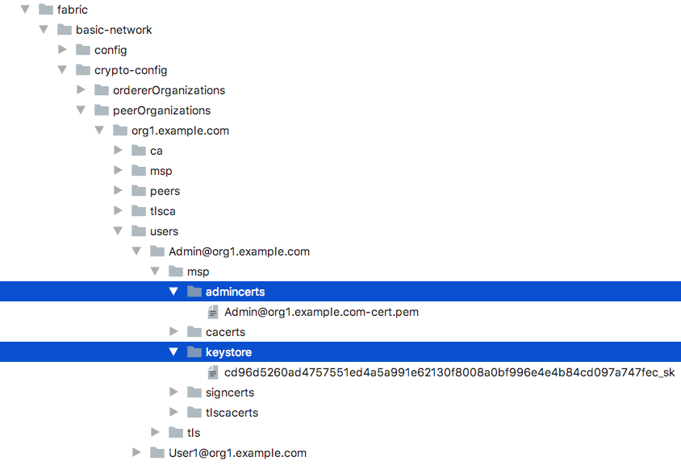

# 用户文档

## 快速入门
1. 预览
2. 开始使用客户端

### 1. 预览
客户端为开箱即用的，跨平台的(适用Windows, Mac, Linux），超级账本（hyperledger fabric）的图形化界面
客户端。客户端主要解决了Hyperledger Cello、Hyperledger Explorer中用户私钥非用户留存的问题，将用户
私钥留存用户本地，并具有数据看板、链码调用、链码安装等核心功能。

### 2.开始使用客户端

#### 2.1 安装客户端
下载客户端

#### 2.2 开始使用
双击打开客户端，开始使用。

1. 用户登录
2. 数据看板
3. 链码调用
4. 链码安装

##### 2.2.1 用户登录
输入peer grpc url,peer event url,orderer url，username，选择certificate文件和private key文件后，点击登录。

注意：在hyperledger fabric体系的角色里，存在peer\orderer\user三种角色，客户端面向user，在user角色下，存在admin和
普通user两种，有一点需要我们谨记的是，admin可安装和调用链码，而普通user只可调用链码。

如：我们在本地运行fabric网络后，peer grpc url 填 grpc://localhost:7051, peer event url 填 grpc://localhost:7053，
orderer url 填 grpc://localhost:7050, username 填 Org1Admin，选择certificate文件为admincerts文件夹下的
Admin@org1.example.com-cert.pem, 选择private key文件为keystore文件夹下的cd96d5260ad4757551ed4a5a991e62130f8008a0bf996e4e4b84cd097a747fec_sk文件
点击登录。

##### 2.2.2 数据看板
在数据看板中，我们可以查询链码相关信息。

点击表格中Hash列任一行的记录，可查看相关信息，如下：

##### 2.2.3 链码调用
在链码调用界面中，输入通道名称、智能合约、函数名称、参数、其中参数可输入多个,并选择是查询或者调用操作后，点击发送按钮，可获得相关
返回信息。

##### 2.2.4 链码安装
在链码安装页面里，我们可以查看已经添加的各个智能合约的状态，是处于已经安装还是已经部署状态.

此外，我们还可以添加新的智能合约，点击添加合约按钮，将会弹出添加合约弹窗。

输入链码名称、版本号、通道名称、链码文件路径和功能描述，其中，链码名称、版本号、通道名称、
链码文件路径为必填项，功能描述非必填项。点击添加，即可添加新的智能合约。

并且您可在新的智能合约窗口中进行相关智能合约操作，如安装、部署、删除操作。

